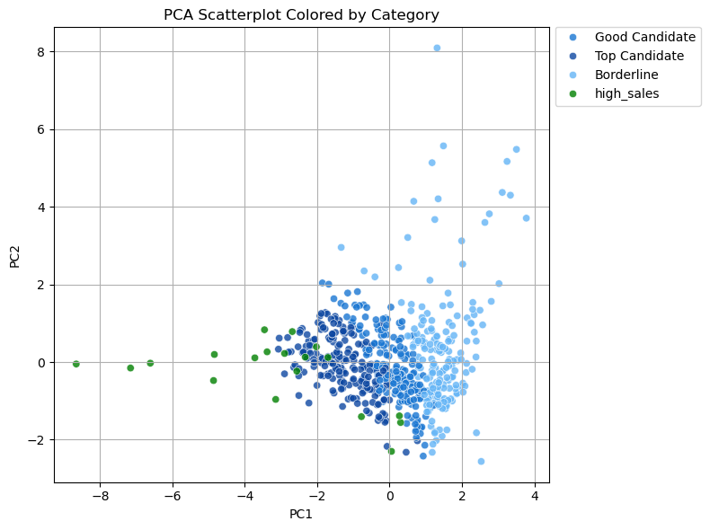
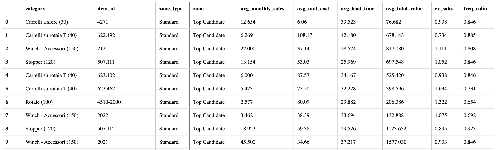
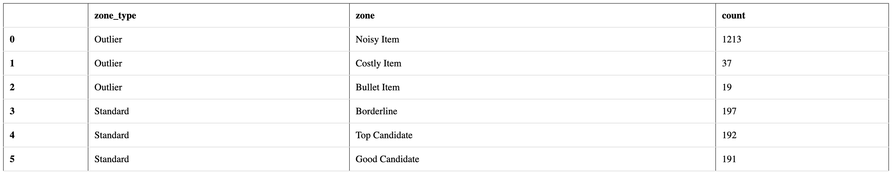

# Raggruppamento Articoli di Vendita - Panoramica del Progetto

---

## 🌐 Obiettivo del Progetto

- **Scopo:** Trovare e classificare gli articoli che sono stabili e prevedibili nella vendita.
- **Metodo:** Utilizzare dati storici per guidare decisioni più informate sulla gestione dello stock.

---

## 🧪 Tecniche utilizzate

- **PCA:** Analisi delle componenti principali (riduzione della dimensionalità).
- **Clustering:** Selezione di oggetti con caratteristiche omogenee a partire da un insieme di dati.

---

## 📊 Passaggi Principali

### 1. Preparazione dei Dati

- Il dataset include:
  - Codici articolo
  - Quantità vendute mensili
  - Costo unitario
  - Lead time (tempo di consegna)

- La selezione dei dati segue queste logiche:
  - Limite dei dati tra 2023-01 fino a 2025-02 incl.
  - Limite delle vendite complete (con date di consegna)
  - che hanno un prezzo di vendita
  - i prezzi di vendita sono stati selezionati in base a un criterio di data (più recenti)

- Sono stati calcolati alcuni indicatori chiave per ogni articolo:
  - **Fatturato medio mensile** (quanto vale economicamente ciascun articolo)
  - **Stabilità delle vendite** (quanto sono regolari mese per mese)
  - **Frequenza di vendita** (in quanti mesi l'articolo è stato venduto)
  - **Costo medio unitario** (il valore di vendita della singola unità)
  - **Lead Time medio** (quanto tempo intercorre tra ordine e vendita)

#### Istogrammi delle principali variabili

> 
> L'immagine mostra la distribuzione di tutti gli articoli combinati in raggruppamenti secondo le variabili principali. Si notano in particolare:
> - **Fatturato**: notare la lunga "coda" a destra.
> - **Volatilità**: notare il peso del "estremamente volatile" a destra.

### 2. Identificazione di Outliers

- Sono stati evidenziati articoli particolari:
  - **Articoli con vendite molto elevate** (top 1%)
  - **Articoli con costo unitario molto alto** (top 2%)
  - **Articoli "rumorosi"** (vendite instabili e poco frequenti)

Questi articoli verranno trattati con attenzione a parte.

#### Proiezione 2D dei principali componenti

> 
> L'immagine distribuisce sul piano cartesiano gli articoli a seconda di etichette: outliers, articoli da tenere e articoli con valori di fatturato estremi. 
> Gli outliers rappresentano virca 2/3 del totale; mentre gli altri due gruppi rappresentano 1/3. 

### 4. Raggruppamento e Prioritizzazione Visiva

#### Step 1: focus su articoli ordinari (non outliers)
- Considerando le diverse variabili insieme, abbiamo rappresentato graficamente gli articoli per identificare quelli più vicini al "profilo ideale":
  - Vendite regolari
  - Costi contenuti
  - Alta frequenza di vendita

- Sono stati tracciati **cerchi** per delimitare:
  - **Top Candidate**
  - **Good Candidate**
  - **Borderline**

> 

---

## 📊 Risultato Finale

#### Step 2: inclusione di articoli con vendite estreme. 
- Una lista pulita di articoli, etichettati come:
  - "Top Candidate" - Migliori candidati per essere mantenuti a stock
  - "Good Candidate" - Da considerare
  - "Borderline" - Più rischiosi
  - Eventuale flag "High Sales" o "Noisy" per articoli particolari

#### Proiezione in 2D dei candidati da mantenere a stock

> 
> L'immagine plotta e raggruppa a seconda delle variabili considerate le 4 'zone'.
> Una revisione manuale degli articoli e delle quantità puo informare la produzione sugli articoli e i volumi da tenere a magazzino.

#### Istogrammi delle principali variabili con focus sugli articoli ordinari

> 
> L'immagine mostra come le curve di distribuzione si normalizzino, infatti abbiamo eliminato gli outliers.

---

## 📚 Risorse

#### Lista degli Articoli e dei Parametri

> 
> Lo screenshot mostra le prime 10 righe della tabella contenente:
> - Codice articolo
> - Rating del Candidato da tenere a magazzino: ('top', 'good', 'borderline')
> - Parametri mensili:
>   - 'Volume di vendita', 
>   - 'Costo unitario', 
>   - 'Lead Time', 
>   - 'Fatturato', 
>   - 'Volatilità', 
>   - 'Frequenza'
> - Categoria articolo

#### Specchietto Riassuntivo dei Cluster

> 
> Lo screenshot mostra il conteggio articoli per Tipo e Rating

## 🎯 Valore per il Business

- Concentrarsi su investimenti di stock più sicuri e prevedibili.
- Ridurre il rischio di mantenere articoli costosi o poco richiesti.
- Fornire raccomandazioni chiare e basate sui dati per la gestione dell'inventario.

- Ulteriori ricerche
  - visualizzare i dati di performance mensili (KPI)

---

# ✨ Conclusione

Questo approccio combina analisi quantitativa, buon senso pratico e visualizzazione dei dati per supportare **decisioni di business più intelligenti**.

