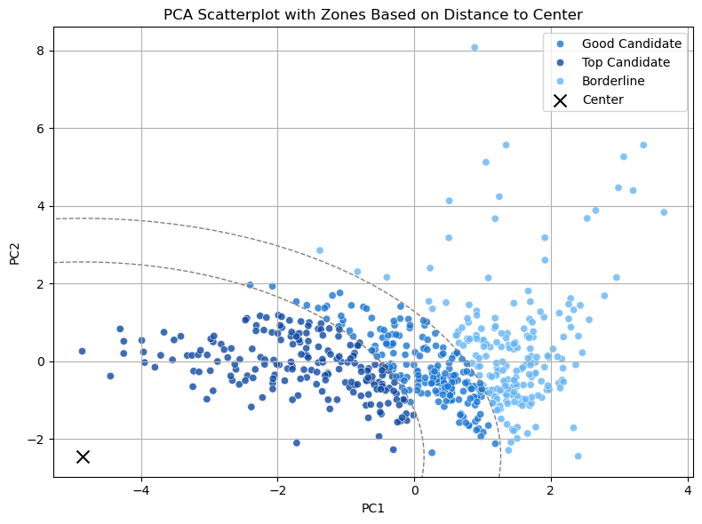

# Raggruppamento Articoli di Vendita - Panoramica del Progetto

Questo progetto ha l'obiettivo di identificare e raggruppare gli articoli di vendita sulla base della loro stabilità, frequenza di vendita, costo e altri parametri rilevanti. Ci aiuta a prioritizzare quali articoli sono i migliori candidati per essere mantenuti a stock. I risultati sono pensati per essere facilmente comprensibili anche da chi non ha un background tecnico.

---

## 🌐 Obiettivo del Progetto

- **Scopo:** Trovare e classificare gli articoli che sono stabili e prevedibili nella vendita.
- **Metodo:** Utilizzare dati storici per guidare decisioni più informate sulla gestione dello stock.

---

## 📊 Passaggi Principali

### 1. Preparazione dei Dati

- Il dataset include:
  - Codici articolo
  - Quantità vendute mensili
  - Costo unitario
  - Lead time (tempo di consegna)

- La selezione dei dati segue queste logiche:
  - Limite dei dati tra gennaio 2023 fino a 2025-02 incl.
  - Limite delle vendite complete (con date di consegna)
  - che hanno un prezzo di vendita
  - i prezzi di vendita sono stati selezionati in base a un criterio di data (più recenti)

- Sono stati calcolati alcuni indicatori chiave per ogni articolo:
  - **Vendite medie mensili**
  - **Stabilità delle vendite** (quanto sono regolari mese per mese)
  - **Frequenza di vendita** (in quanti mesi l'articolo è stato venduto)
  - **Costo medio unitario**
  - **Lead time medio**

#### Istogrammi delle principali variabili
L'immagine mostra la distribuzione di tutti gli articoli combinati in raggruppamenti secondo le variabili principali. 

### 2. Identificazione di Outliers

- Sono stati evidenziati articoli particolari:
  - **Articoli con vendite molto elevate** (top 1%)
  - **Articoli con costo unitario molto alto** (top 2%)
  - **Articoli "rumorosi"** (vendite instabili e poco frequenti)

Questi articoli vengono trattati con attenzione a parte.

### 4. Raggruppamento e Prioritizzazione Visiva

- Considerando le diverse variabili insieme, abbiamo rappresentato graficamente gli articoli per identificare quelli più vicini al "profilo ideale":
  - Vendite regolari
  - Costi contenuti
  - Alta frequenza di vendita

- Sono stati tracciati **cerchi** per delimitare:
  - **Top Candidate**
  - **Good Candidate**
  - **Borderline**

---

## 📊 Risultato Finale

- Una lista pulita di articoli, etichettati come:
  - "Top Candidate" - Migliori candidati per essere mantenuti a stock
  - "Good Candidate" - Da considerare
  - "Borderline" - Più rischiosi
  - Eventuale flag "High Sales" o "Noisy" per articoli particolari

---

## 🎯 Valore per il Business

- Concentrarsi su investimenti di stock più sicuri e prevedibili.
- Ridurre il rischio di mantenere articoli costosi o poco richiesti.
- Fornire raccomandazioni chiare e basate sui dati per la gestione dell'inventario.

- Ulteriori ricerche
  - visualizzare i dati di performance mensili (KPI)

---

# ✨ Conclusione

Questo approccio combina analisi quantitativa, buon senso pratico e visualizzazione dei dati per supportare **decisioni di business più intelligenti**.

